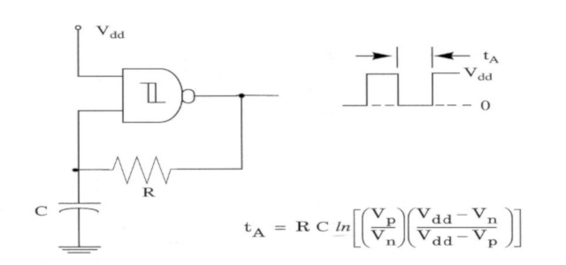
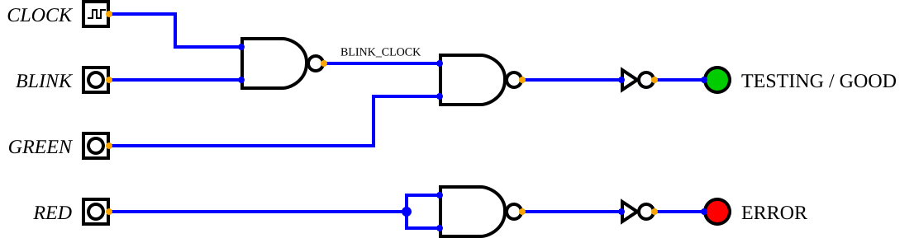

# ZIFter
ZIFter is a simple, low-cost IC tester for sifting through collections of old and new-old-stock (NOS) logic and memory chips.
It also serves as a development platform for software concepts that may eventually find their way into Orterax.

## Status
⚠️ **Preliminary / In Active Development**

## Implementation
It is implemented as a shield for an Arduino Mega 2560 and can test IC's up to 32 pins.
Both 300 mil and 600 mil ICs, requiring a ZIF-32 socket that can accommodate both widths.
All compatible ICs have +5V (Vcc) opposite of pin-1.
I.e. ICs are aligned to the same end of the socket, so pin-1 is always at the same position.
The Arduino Mega 2560 is chosen because it has 5V I/O as well as enough I/O pins to avoid I/O expanders.
This will increase the testing speed.
Early calculations for the AS6C4008 (628512) reduce the test time from 10 minutes to less than 60 seconds.
ZIFter is severely lacking in protection circuits and will not feature discovery algorithms.

## Switching Vcc
Vcc will be switched through a P-channel MOSFET: SI2301.
A pull-up (10k) resistor from the gate to Vcc is used to make sure Vcc is off.
This may be important if a user powers-up with a device in the ZIF-32.
The Vcc pin is always aligned with pin 32 of the ZIF-32 socket.
In addition, a yellow 3mm led will be in parallel to the Vcc to show if the socket is powered.

## Switching GND
GND is switched through a N-channel MOSFET: SI2302. 
Again, there is no need for pull-down or series resistors.
The pin switched to ground is always the number of pins divided by 2.
This is the pin diagonally opposite of Vcc.
Several package sizes can been used: 14, 16, 18, 20, 22, 24, 28 and 32 pins.
Note that 26 and 30 pin packages are missing (as well as 34 and 38, but they are larger than 32).
This requires 8 connections to GND at pin 7, 8, 9, 10, 11, 12, 14 and 16.
This is a constraint of the design.
ICs with exotic pin layout, or non-standard Vcc and/or GND connections cannot be used by this tester.


## Decoupling
A 100nF ceramic capacitor is used between the permanent +5V rail and permanent GND rail.
It is specifically not switched as its charge could potentially discharge to the chip if Vcc and GND are swiched-off.
Probably just _theoretical_ damage a chip, but better safe than sorry.
A 10 μF capacitor (10V) is used to help stabilize Vcc.

## Indication LEDs
| LED | Colour | Function     | Remarks                                    |
| :-: | :----- | :----------- | :----------------------------------------- |
| 🟡  | Yellow  | DUT power    | Powered from Vcc/GND DUT                   |
| 🟢  | Green   | Testing/Pass | Blinking while testing, steady when PASS   |
| 🔴  | Red     | Error        | Steady if FAIL                             |

* **Yellow**: This is the power of device under test (DUT). Anode goes to switched +5V. GND is GND bus through 4K7 Ω series resistor.
* **Green**: Blinking during testing, steady when the test finished and passed.
* **Red**: If the test failed, steady.


### Implementation
In order to have leave the MCU free for testing, the Green blinking is implemented with an independent blinker circuit.
As we needed some logic, I decided to use a CD4093 quad 2-input NAND Schmitt trigger.
One gate is used as an simple RC oscillator, about 1 Hz.
This requires a capacitor of 2.2 μF to GND and a feedback resistor of 1 MΩ.



This is gated with a NAND with the `BLINK` output pin to create `BLINK_CLOCK`.
The `GREEN` output of the MCU is gated with `BLINK_CLOCK` to output the signal for the green LED.
The NAND output has a series resistor of 4K7 Ω to Vcc.
The `RED` output pin is inverted using the last NAND in the CD4093.
Again this output has a series resistor of 4K7 Ω to Vcc.



The inverters are not in the final circuit and are there just to duplicate the effect that the LEDs are tied to Vcc and not to GND (i.e. on when the input is low).
The [Digital](https://github.com/hneemann/Digital) simulation file is [here](./blinkenlights.dig).


| Code | BLINK | GREEN | RED   | State                         |
| :--: | :---: | :---: | :---: | :---------------------------- |
| 0x00 |   0   |   0   |   0   |  both red and green are off   |
| 0x01 |   0   |   0   |   1   |  only red is on               |
| 0x02 |   0   |   1   |   0   |  only green is on             |
| 0x03 |   0   |   1   |   1   |  both red and green are on    |
| 0x04 |   1   |   0   |   0   |  both red and green are off   |
| 0x05 |   1   |   0   |   1   |  only red is on               |
| 0x06 |   1   |   1   |   0   |  green is blinking            |
| 0x07 |   1   |   1   |   1   |  red is on, green is blinking |

Only codes 0x00, 0x01, 0x02 and 0x06 make sense for ZIFter.

## Current sensing
High-side current/voltage sensing is mandatory for Orterax and a useful feature for ZIFter.
It can be used to detect over-current and switch off Vcc long before a poly-fuse is tripped.
Also, it can be used to differentiate between logic compatible NMOS and CMOS variants.
Additionally it can be used to check the number of pins of the DUT if current sensing is available.
Apply Vcc, then switch pins 16, 14, 12, 11, 10, 9, 8 and 7 to detect if a device is present.
The INA219 I²C current and voltage sensor can be used.
The INA219 is not available in a DIP package (SOT-23-5) but can be soldered on a adapter PCB for the POC.


## Proof of concept
The proof of concept (POC) is build on a Arduino Mega protoboard.
As it is rather difficult to solder SMD components on a protoboard with 2.54 mm spacing, through-hole components are used.
The Vcc MOSFET (SI2301) is replaced by a SIP-1A05 reed relay.
This does require a (1N4148/1N914) flyback diode.
The GND MOSFETs (SI2302) are replaced with the through-hole ALJ2302 instead (SI3202 in TO-92 package).
The POC may eventually get a PCB, but as protection is totally absent, it may be better to put all effort in Orterax.


## Device list SRAM
| IC       | Generic | Manufacturer | Pins | bits  | Words | bit | Comments            |
| :------- | :------ | :----------- | :--: | ----: | ----: | :-: | :------------------ |
| CY62128  | 62128   | Cypress      | 32   | 1024k | 128k  | 8   |                     |
| 628512   | 628512  | Various      | 32   | 4096k | 512k  | 8   |                     |
| AS6C4008 | 628512  | Alliance     | 32   | 4096k | 512k  | 8   |                     |
| CY62512V | 628512  | Cypress      | 32   | 4096k | 512k  | 8   |                     |
| 62256    | 62256   | Various      | 28   | 256k  | 32k   | 8   |                     |
| CY62256N | 62256   | Cypress      | 28   | 256k  | 32k   | 8   |                     |
| 6264     | 6264    | Various      | 28   | 64k   | 8k    | 8   |                     |
| MCM6264  | 6264    | Motorola     | 28   | 64k   | 8k    | 8   |                     |
| CY7C199  | 62256   | Cypress      | 28   | 256k  | 32k   | 8   |                     |
| UM6164   | 6164    | UMC          | 28   | 64k   | 8k    | 8   |                     |
| CY7C185  | 6264    | Cypress      | 28   | 64k   | 8k    | 8   |                     |
| CY7C196  |         | Cypress      | 28   | 256k  | 64k   | 4   |                     |
| CY7C195  |         | Cypress      | 28   | 256k  | 64k   | 4   |                     |
| CY7C194  |         | Cypress      | 24   | 256k  | 64k   | 4   |                     |
| CY7C128A |         | Cypress      | 24   | 16k   | 2k    | 8   |                     |
| 6116     | 6116    | Various      | 24   | 16k   | 2k    | 8   |                     |
| UM6116   | 6116    | UMC          | 24   | 16k   | 2k    | 8   |                     |
| SR64K4   |         | Lattice      | 11   | 64k   | 16k   | 4   |                     |
| UM6167   | 6167    | UMC          | 20   | 16k   | 1k    | 1   | separate Din/Dout   |
| IDT6167  | 6167    | IDT          | 20   | 16k   | 1k    | 1   | separate Din/Dout   |
| P4C167   | 6167    | Pyramid      | 20   | 16k   | 1k    | 1   | separate Din/Dout   |
| IS61C67  | 6167    | ISSI         | 20   | 16k   | 1k    | 1   | separate Din/Dout   |
| 6168     | 6168    | IDT          | 20   | 16k   | 4k    | 4   |                     |
| 2148     | 2148    | AMD          | 18   | 4k    | 1k    | 4   |                     |
| 2149     | 2149    | AMD          | 18   | 4k    | 1k    | 4   |                     |
| P2114    | 2114    | Intel        | 18   | 4k    | 1k    | 4   |                     |
| MK4114   | 2114    | Mostek       | 18   | 4k    | 1k    | 4   |                     |
| NM2114   | 2114    | NS           | 18   | 4k    | 1k    | 4   |                     |
| TMS2114  | 2114    | TI           | 18   | 4k    | 1k    | 4   |                     |
| μPD2114  | 2114    | NEC          | 18   | 4k    | 1k    | 4   |                     |
| 2114     | 2114    | Various      | 18   | 4k    | 1k    | 4   |                     |
| MB8114   | 2114    | Fujitsu      | 18   | 4k    | 1k    | 4   |                     |
| HM6114   | 2114    | Hitachi      | 18   | 4k    | 1k    | 4   |                     |
| M5M2114  | 2114    | Mitsubishi   | 18   | 4k    | 1k    | 4   |                     |
| TC5514   | 2114    | Toshiba      | 18   | 4k    | 1k    | 4   |                     |
| SAB 2114 | 2114    | Siemens      | 18   | 4k    | 1k    | 4   |                     |
| M2114    | 2114    | SGS          | 18   | 4k    | 1k    | 4   |                     |
| HM6514   | 2114    | Harris       | 18   | 4k    | 1k    | 4   |                     |
| MCM2148  | 2114    | Motorola     | 18   | 4k    | 1k    | 4   |                     |
| 2125A    | 2125    | Intel        | 16   | 1k    | 1k    | 1   |                     |
| 2115A    | 2115    | Intel        | 16   | 1k    | 1k    | 1   |                     |
| 2102A    | 2102    | Intel        | 16   | 1k    | 1k    | 1   | separate Din/Dout   |
| HM6508   | 6805    | Intersil     | 16   | 1k    | 1k    | 1   | different from 2102A|
 
We'll start with the following device list:

| IC       | Type    | Pins | Comments                          |
| :------- | :------ | :--: | :-------------------------------- |
| AS6C4008 | SRAM    | 32   | Alliance, 4096 kbit (512k x 8)    |
| CY7C194  | SRAM    | 24   | Cypress, 256 kbit (64k x 4)       |
| SR64K4   | SRAM    | 11   | Lattice, 64 kbit (16k x 4)        |
| 74LS00   | TTL     | 14   | Various, quad two-input nand gate |
| CD4011   | CMOS    | 14   | Various, quad two-inpyt nand gate |


Specifically **not** supported ICs:

| IC       | Type    | Pins | Comments                                |
| :------- | :------ | :--: | :-------------------------------------- |
| TC5501   | SRAM    | 22   | Toshiba, 256x4 GND=8 [^tc5501]          |
| 2602     | SRAM    | 16   | Signetics, 1024x1, Vcc=10, GND=9        |
| 7473     | TTL     | 14   | dual JK flip-flop, Vcc=4, GND=11        |
| 7475     | TTL     | 16   | 4-bit bi-stable latch, Vcc=5, GND=12    |
| 7476     | TTL     | 16   | dual JK flip-flop, Vcc=5, GND=13        |
| 7490     | TTL     | 14   | decade counter, Vcc=5, GND=10           |
| 7492     | TTL     | 14   | divide-by-twelve counter, Vcc=5, GND=10 |
| 7493     | TTL     | 14   | 4-bit binary counter. Vcc=5, GND=10     |
| 4049     | CMOS    | 16   | hex inverter, Vcc=1, GND=8 [^pin1]      |
| 4050     | CMOS    | 16   | hex non-inverting buffer, Vcc=1, GND=8  |

[^tc5501]: As Vcc (Vdd) is opposite pin 1 and pin 8 _may_ be switched to GND, we could possibly promote this to **supported**.
[^pin1]: In order to support the popular CMOS 4049/4050 ICs, we need to switch Vcc to pin 1 (pin 16 is NC).

```
# ZIF pin 1..32 -> Arduino Mega digital pin. Wire once, never touch again.
const uint8_t ZIF_TO_ARDUINO[33] = { /* [0] unused, [1..32] = pin */ };

enum PinRole : uint8_t {
  NC, VCC, 
  GND_P8, GND_P9, GND_P10, GND_P11, GND_P12, GND_P14, GND_P16, // Explicit GND pins
  A0,A1,A2,A3,A4,A5,A6,A7,A8,A9,A10,A11,A12,A13,A14,A15,A16,A17,A18,
  D0,D1,D2,D3,D4,D5,D6,D7,
  DIN, DOUT,                                             # Split I/O (e.g., 2102, 6167)
  WE, OE, CE, CE2
};

struct ChipPin { 
  uint8_t zifPin; 
  PinRole role; 
};

struct ChipDef {
  const char* name;
  uint8_t     pinCount;   # 16, 18, 20, 22, 24, 28, 32
  uint8_t     dataWidth;  # 8, 4, or 1
  const ChipPin* pins;    # Only active pins
  uint8_t     numPins;
};
```
