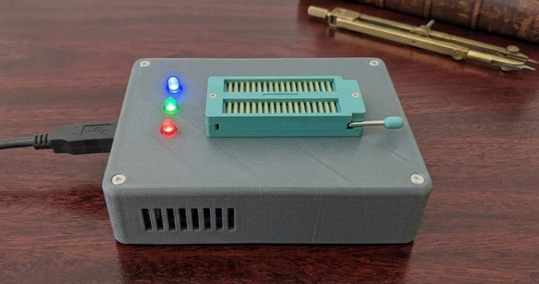

# ZIFter
ZIFter is a simple, low-cost IC tester for sifting through collections of old and new-old-stock (NOS) logic and memory chips.
It also serves as a development platform for software concepts that may eventually find their way into _Orterax_.
It lacks protection circuitry and will not feature IC discovery algorithms.

## Status
⚠️ **Preliminary / In active development**

## Implementation
ZIFter is implemented as a shield for an Arduino Mega 2560 and can test ICs of up to 32 pins.
It accepts both 300 mil and 600 mil ICs, which requires a ZIF-32 socket that can accommodate both widths.
All compatible ICs have +5V (Vcc) on the pin opposite pin 1.
That is, ICs are aligned to the same end of the socket, so pin 1 is always in the same position.
The Arduino Mega 2560 is chosen because it has 5V I/O as well as enough I/O pins to avoid I/O expanders.
Avoiding expanders also increases the testing speed.
Early calculations for the AS6C4008 (628512) put the test time at less than 60 seconds,
down from 10 minutes when using I/O expanders.

## Switching Vcc
Vcc is switched through a P-channel MOSFET: SI2301.
A pull-up resistor (10 kΩ) from the gate to Vcc makes sure the MOSFET is off by default.
This may be important if a user powers up with a device in the ZIF-32 socket.
The Vcc pin is always aligned with pin 32 of the ZIF-32 socket.
A blue 3 mm LED is placed in parallel with Vcc to show whether the socket is powered.

## Switching GND
GND is switched through an N-channel MOSFET: SI2302.
There is no need for pull-down or series resistors.
The pin switched to ground is always the number of pins divided by 2.
This is the pin diagonally opposite Vcc.
Several package sizes can be used: 14, 16, 18, 20, 22, 24, 28 and 32 pins.
Note that 26- and 30-pin packages are missing.
This requires 8 connections to GND, at pins 7, 8, 9, 10, 11, 12, 14 and 16.
This is a constraint of the design.
ICs with an exotic pin layout, or with non-standard Vcc and/or GND connections, cannot be used with this tester.

## Decoupling
A 100 nF ceramic capacitor is used between the permanent +5V rail and the permanent GND rail.
It is specifically not switched, as its charge could potentially discharge into the chip if Vcc and GND are switched off.
This is probably only a _theoretical_ risk to the chip, but better safe than sorry.
A 10 μF capacitor (10V) is used to help stabilise Vcc.

## Indication LEDs
| LED | Colour | Function     | Remarks                                   |
| :-: | :----- | :----------- | :---------------------------------------- |
| 🔵  | Blue   | DUT power    | Powered from the DUT Vcc/GND              |
| 🟢  | Green  | Testing/Pass | Blinking while testing, steady when PASS  |
| 🔴  | Red    | Error        | Steady if FAIL                            |

* **Blue**: This indicates power to the device under test (DUT). The anode goes to switched +5V, the cathode to the GND bus through a 4k7 series resistor.
* **Green**: Blinking during testing, steady when the test has finished and passed.
* **Red**: Steady if the test failed.

### LED driver implementation
In order to leave the MCU free for testing, the green blinking is implemented with an independent blinker circuit.
As some logic was needed anyway, I decided to use a CD4093 quad 2-input NAND Schmitt trigger.
One gate is used as a simple RC oscillator.
A capacitor of 2.2 μF to GND and a feedback resistor of 1 MΩ give a reasonable blink rate.

The oscillator output is NANDed with the `BLINK` output pin of the MCU to create `BLINK_CLOCK`.
The `BLUE` output of the MCU is then NANDed with `BLINK_CLOCK` to drive the green LED. 
That NAND output has a 3k3 series resistor to the LED, which is tied to Vcc.
The `RED` output pin is inverted using the last NAND in the CD4093.
Again, this output has a 3k3 series resistor to the LED, which is tied to Vcc.

The inverters are not in the final circuit; they are only there to reproduce
the effect of the LEDs being tied to Vcc rather than to GND (i.e. on when the input is low).
The [Digital](https://github.com/hneemann/Digital) simulation file is [here](./blinkenlights.dig).

| Code | BLINK | GREEN | RED   | State                         |
| :--: | :---: | :---: | :---: | :---------------------------- |
| 0x00 |   0   |   0   |   0   |  both red and green are off   |
| 0x01 |   0   |   0   |   1   |  only red is on               |
| 0x02 |   0   |   1   |   0   |  only green is on             |
| 0x03 |   0   |   1   |   1   |  both red and green are on    |
| 0x04 |   1   |   0   |   0   |  both red and green are off   |
| 0x05 |   1   |   0   |   1   |  only red is on               |
| 0x06 |   1   |   1   |   0   |  green is blinking            |
| 0x07 |   1   |   1   |   1   |  red is on, green is blinking |

Only codes 0x00, 0x01, 0x02 and 0x06 make sense for ZIFter.

## Current sensing
High-side current/voltage sensing is mandatory for Orterax and a useful feature for ZIFter.
It can be used to detect overcurrent and switch off Vcc long before a polyfuse is tripped.
It can also be used to differentiate between logic-compatible NMOS and CMOS variants.
Additionally, it can be used to determine the pin count of the DUT: apply Vcc,
then switch pins 16, 14, 12, 11, 10, 9, 8 and 7 in turn to detect whether a device is present.
The INA219 I²C current and voltage sensor can be used.
The INA219 is not available in a DIP package (only SOT-23-8 or SOIC-8),
but it can be soldered onto an adapter PCB for the POC.

## Proof of concept
The proof of concept (POC) is built on an Arduino Mega protoboard.
As it is rather difficult to solder SMD components onto a protoboard with 2.54 mm spacing,
through-hole components are used.
The Vcc MOSFET (SI2301) is replaced by a SIP-1A05 reed relay.
This does require a flyback diode (1N4148/1N914).
The GND MOSFETs (SI2302) are replaced by the through-hole ALJ2302 (SI2302 in a TO-92 package).
The POC may eventually get a PCB, but as protection is totally absent,
it may be better to put all effort into Orterax.

## Device list SRAM
| IC       | Generic | Manufacturer | Pins | Bits  | Words | Width | Comments             |
| :------- | :------ | :----------- | :--: | ----: | ----: | :---: | :------------------- |
| CY62128  | 62128   | Cypress      | 32   | 1024k | 128k  | 8     |                      |
| 628512   | 628512  | Various      | 32   | 4096k | 512k  | 8     |                      |
| AS6C4008 | 628512  | Alliance     | 32   | 4096k | 512k  | 8     |                      |
| CY62512V | 628512  | Cypress      | 32   | 4096k | 512k  | 8     |                      |
| 62256    | 62256   | Various      | 28   | 256k  | 32k   | 8     |                      |
| CY62256N | 62256   | Cypress      | 28   | 256k  | 32k   | 8     |                      |
| 6264     | 6264    | Various      | 28   | 64k   | 8k    | 8     |                      |
| MCM6264  | 6264    | Motorola     | 28   | 64k   | 8k    | 8     |                      |
| CY7C199  | 62256   | Cypress      | 28   | 256k  | 32k   | 8     |                      |
| UM6164   | 6164    | UMC          | 28   | 64k   | 8k    | 8     |                      |
| CY7C185  | 6264    | Cypress      | 28   | 64k   | 8k    | 8     |                      |
| CY7C196  |         | Cypress      | 28   | 256k  | 64k   | 4     |                      |
| CY7C195  |         | Cypress      | 28   | 256k  | 64k   | 4     |                      |
| CY7C194  |         | Cypress      | 24   | 256k  | 64k   | 4     |                      |
| CY7C128A |         | Cypress      | 24   | 16k   | 2k    | 8     |                      |
| 6116     | 6116    | Various      | 24   | 16k   | 2k    | 8     |                      |
| UM6116   | 6116    | UMC          | 24   | 16k   | 2k    | 8     |                      |
| SR64K4   |         | Lattice      | 22   | 64k   | 16k   | 4     |                      |
| UM6167   | 6167    | UMC          | 20   | 16k   | 1k    | 1     | separate Din/Dout    |
| IDT6167  | 6167    | IDT          | 20   | 16k   | 1k    | 1     | separate Din/Dout    |
| P4C167   | 6167    | Pyramid      | 20   | 16k   | 1k    | 1     | separate Din/Dout    |
| IS61C67  | 6167    | ISSI         | 20   | 16k   | 1k    | 1     | separate Din/Dout    |
| 6168     | 6168    | IDT          | 20   | 16k   | 4k    | 4     |                      |
| 2148     | 2148    | AMD          | 18   | 4k    | 1k    | 4     |                      |
| 2149     | 2149    | AMD          | 18   | 4k    | 1k    | 4     |                      |
| P2114    | 2114    | Intel        | 18   | 4k    | 1k    | 4     |                      |
| MK4114   | 2114    | Mostek       | 18   | 4k    | 1k    | 4     |                      |
| NM2114   | 2114    | NS           | 18   | 4k    | 1k    | 4     |                      |
| TMS2114  | 2114    | TI           | 18   | 4k    | 1k    | 4     |                      |
| μPD2114  | 2114    | NEC          | 18   | 4k    | 1k    | 4     |                      |
| 2114     | 2114    | Various      | 18   | 4k    | 1k    | 4     |                      |
| MB8114   | 2114    | Fujitsu      | 18   | 4k    | 1k    | 4     |                      |
| HM6114   | 2114    | Hitachi      | 18   | 4k    | 1k    | 4     |                      |
| M5M2114  | 2114    | Mitsubishi   | 18   | 4k    | 1k    | 4     |                      |
| TC5514   | 2114    | Toshiba      | 18   | 4k    | 1k    | 4     |                      |
| SAB 2114 | 2114    | Siemens      | 18   | 4k    | 1k    | 4     |                      |
| M2114    | 2114    | SGS          | 18   | 4k    | 1k    | 4     |                      |
| HM6514   | 2114    | Harris       | 18   | 4k    | 1k    | 4     |                      |
| MCM2148  | 2148    | Motorola     | 18   | 4k    | 1k    | 4     |                      |
| 2125A    | 2125    | Intel        | 16   | 1k    | 1k    | 1     |                      |
| 2115A    | 2115    | Intel        | 16   | 1k    | 1k    | 1     |                      |
| 2102A    | 2102    | Intel        | 16   | 1k    | 1k    | 1     | separate Din/Dout    |
| HM6508   | 6508    | Intersil     | 16   | 1k    | 1k    | 1     | different from 2102A |

We'll start with the following device list:

| IC       | Type    | Pins | Comments                          |
| :------- | :------ | :--: | :-------------------------------- |
| AS6C4008 | SRAM    | 32   | Alliance, 4096 kbit (512k x 8)    |
| CY7C194  | SRAM    | 24   | Cypress, 256 kbit (64k x 4)       |
| SR64K4   | SRAM    | 22   | Lattice, 64 kbit (16k x 4)        |
| 74LS00   | TTL     | 14   | Various, quad 2-input NAND gate   |
| CD4011   | CMOS    | 14   | Various, quad 2-input NAND gate   |

Specifically **not** supported ICs:

| IC       | Type    | Pins | Comments                                |
| :------- | :------ | :--: | :-------------------------------------- |
| TC5501   | SRAM    | 22   | Toshiba, 256x4, Vcc=22, GND=8 [^tc5501] |
| 2602     | SRAM    | 16   | Signetics, 1024x1, Vcc=10, GND=9        |
| 7473     | TTL     | 14   | dual JK flip-flop, Vcc=4, GND=11        |
| 7475     | TTL     | 16   | 4-bit bistable latch, Vcc=5, GND=12     |
| 7476     | TTL     | 16   | dual JK flip-flop, Vcc=5, GND=13        |
| 7490     | TTL     | 14   | decade counter, Vcc=5, GND=10           |
| 7492     | TTL     | 14   | divide-by-twelve counter, Vcc=5, GND=10 |
| 7493     | TTL     | 14   | 4-bit binary counter, Vcc=5, GND=10     |
| 4049     | CMOS    | 16   | hex inverter, Vcc=1, GND=8 [^pin1]      |
| 4050     | CMOS    | 16   | hex non-inverting buffer, Vcc=1, GND=8  |

[^tc5501]: Pin 8 _may_ be switched to GND, so we could possibly promote this to **supported**.  
[^pin1]: In order to support the popular CMOS 4049/4050 ICs, we need to switch Vcc to pin 1 (pin 16 is NC).  

## DRAM
Retro DRAMs are not on the supported list.
The 4116 is the odd one out: it needs -5V on pin 1 and +12V on pin 8, and it has GND on pin 16.
Later +5V-only DRAMs such as the 4164, 41256 and 411000/511000 all use GND on the pin opposite pin 1,
and Vcc on the pin diagonally opposite GND.
This is exactly the opposite of the majority of SRAMs and TTL/CMOS logic.
In order to support that, we would need to switch Vcc at various pins, depending on the package.
GND could then be switched at a single pin.
This is more than just moving pins around, as the N-channel MOSFETs would need to be swapped for P-channel MOSFETs.
To also support the 4116, we would need to provide -5V and +12V as well.
It is certainly possible to build a specific DRAM test shield that also incorporates the DC-DC converters.
But the Arduino Mega 2560 + shield concept does not allow for meaningful speed testing.
Supporting the 4 Mbit DRAMs will be difficult,
because the most common P-SOJ-26/20-2 package has a 1.27 mm pitch and won't fit a ZIF-32.
They were also commonly used in SIP and SIMM modules.